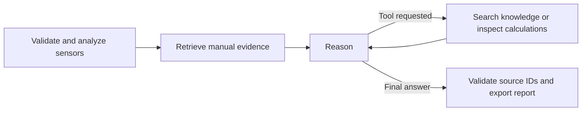

# FaultSense

A Python engineering investigation agent for motor temperature, vibration, current and speed. It screens numerical observations, retrieves supporting manual passages, and uses Gemini tools through LangGraph to produce a cited report. It does not confirm root causes or actuate machinery.

## Start on Windows

Install Python **3.12** (the tested version) with its Python launcher. Double-click `start.bat` in this folder. The first launch installs dependencies into this project's `.venv`. The app opens at http://localhost:8501. Internet is needed for installation and Gemini mode; the installed offline demo needs no API.

Alternatively, from this folder:

```powershell
py -3.12 -m venv .venv
.venv\Scripts\python.exe -m pip install -r requirements.txt
.venv\Scripts\python.exe -m streamlit run app.py --server.port 8501
```

## API configuration

One Google Gemini API key supports both generation and embeddings. Existing `../.env` is loaded automatically, after a local `.env`, with operating-system variables taking precedence. For a standalone copy, copy `.env.example` to `.env` and set `GEMINI_API_KEY`. Never commit or share `.env`.

Default generation model: `gemini-3.8-flash`. Embedding model: `gemini-embedding-001` with 768 dimensions. Override through `GEMINI_MODEL` and `GEMINI_EMBEDDING_MODEL`. Model access and quota depend on your account. API mode sends reference text, the request and computed analysis to Google; offline mode makes no model calls. No new key is included in this project.

## Input and output

1. Keep **Use the included motor demonstration** checked for a complete first run.
2. Or upload a UTF-8 CSV with `timestamp,temperature_c,vibration_mm_s,current_a,rpm`.
3. Upload text-based PDF or UTF-8 TXT manuals. Provide actual operating limits in the sidebar. Demo limits are fictional teaching values, not standards.
4. Describe the symptoms and click **Analyze machine**.
5. Inspect the diagnostic report, sensor trends with limit lines, retrieved evidence and workflow trace. Download a complete Markdown report or JSON analysis.

Input limits: 5–100,000 sensor rows, 10 MB per file, up to 100 pages per PDF and 200 reference chunks per run. Missing/non-finite measurements, duplicate timestamps and negative vibration/current/RPM are rejected. Scanned PDFs need OCR elsewhere first. No uploaded filename is used as a destination path.

## Architecture

`app.py` provides the interface; `engineering.py` validates and computes; `runtime.py` handles retrieval, API calls and the graph. Each project is standalone.



LangGraph state stores the computed result, retrieved passages, model conversation, pending tool calls, bounded iteration count and trace. A maximum of three tool rounds and six calls per round prevents uncontrolled loops. Generation explicitly requests a registered tool on the first model turn. API failures are surfaced, never silently replaced with offline output. Transient provider errors have two bounded retries.

PDF text is chunked per page into 220-word passages with 40-word overlap. Gemini creates document/query embeddings; normalized vectors live in a per-run NumPy vector store and are searched by cosine similarity. Source IDs, filenames and pages accompany retrieved passages. Offline mode uses deterministic lexical hash vectors and a rule-based report: **it is not semantic embedding or an LLM demonstration**. Use Gemini mode to demonstrate the full AI rubric.

## Engineering methodology

Operating-limit checks and within-run robust deviations are distinct. Robust screening uses median absolute deviation, with a relative deviation fallback for constant baselines. Rule priorities associate high temperature/current with load or supply issues, vibration with mechanical hypotheses, and high temperature with cooling hypotheses. They are explainable heuristics, not calibrated fault probabilities. No historical predictive-maintenance model is claimed. Irregular sampling and truncated anomaly lists are reported.

Manual passages support investigation, but operating limits are user-entered and not automatically certified against the manual. Source-ID validation catches nonexistent references; it does not establish that every model claim is entailed. Confirm conclusions against the evidence.

## Tests and demonstration

```powershell
.venv\Scripts\python.exe -m pytest -q
```

See `RUBRIC_AND_DEMO.md` for the five evaluation categories and a spoken demo outline. `sample_data/verified_ai_report.md`, when present, is an actual Gemini run over synthetic fixtures, not a manufacturer diagnostic report.

Official implementation references: [LangGraph Graph API](https://docs.langchain.com/oss/python/langgraph/graph-api), [Gemini function calling](https://ai.google.dev/gemini-api/docs/function-calling), [Gemini embeddings](https://ai.google.dev/gemini-api/docs/embeddings).
