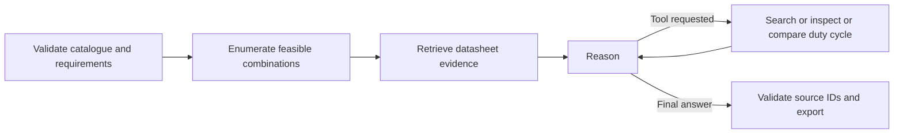

# BuildWise

A Python component-selection agent for a battery-powered digital temperature sensor node. It enumerates controller/sensor/battery/regulator combinations, checks engineering constraints, retrieves specification evidence and uses a Gemini tool-calling LangGraph to explain the results.

## Start on Windows

Install Python **3.12** (tested) with the Python launcher and double-click `start.bat`. The first launch installs requirements into this project's `.venv`; the app opens at http://localhost:8502.

```powershell
py -3.12 -m venv .venv
.venv\Scripts\python.exe -m pip install -r requirements.txt
.venv\Scripts\python.exe -m streamlit run app.py --server.port 8502
```

Internet is required to install dependencies and use Gemini. Installed offline mode requires no API.

## API configuration

Use the same Google Gemini API key as FaultSense. The app reads local `.env`, then `../.env`; operating-system variables take precedence. If running standalone, copy `.env.example` to `.env` and fill in `GEMINI_API_KEY`. Defaults: `GEMINI_MODEL=gemini-3.8-flash`, `GEMINI_EMBEDDING_MODEL=gemini-embedding-001`. Do not commit `.env`.

Gemini mode sends design requirements, reference text and computed catalogue results to Google. Offline mode performs deterministic constraint solving and lexical retrieval only; it is explicitly not an LLM or semantic-embedding run. Use Gemini mode for full rubric demonstration. Quota and model access are account-dependent.

## Inputs and outputs

Start with **Use the included component demonstration** checked. Set budget, target runtime, measurement interval, active time, usable battery fraction and Wi-Fi requirement. These form fields are the authoritative hard constraints. Free-text preferences are context; unmodelled requirements are not automatically enforced.

For your own data, upload a catalogue CSV following `sample_data/components.csv`, plus text-based PDF or TXT datasheets. Every component needs a unique ID, price, stock, source and the numeric columns shown in the sample. Use zero for inapplicable numeric fields; missing values are rejected. Each row represents one part available in quantity one or more. Interfaces use `I2C|SPI` for controller capabilities and a single interface for the sensor.

The output includes the least-cost feasible BOM, alternatives, estimated runtime, each constraint's pass/fail status, sources, assumptions and a visible workflow trace. Download BOM CSV, analysis JSON or complete Markdown report. If no combination meets every modelled constraint, no recommendation is issued and failing alternatives are shown without silently relaxing the requirements.

The included parts, prices and references are **synthetic teaching fixtures**, not real supplier data. Real datasheet text is retrieved, but structured numeric catalogue values must be entered/verified by the user. PDF-to-catalogue extraction is not implemented or claimed. No live pricing service is connected.

## Engineering model

One controller + one sensor + one battery + one regulator per design. Up to 80 rows and 20,000 combinations. The solver checks regulated supply ranges, logic voltage, interface, Wi-Fi, the full battery voltage envelope, regulator current with 20% headroom, cost and runtime.

```
duty = active_seconds / measurement_interval_seconds
average_load_mA = combined_active_mA * duty + combined_sleep_mA * (1 - duty)
battery_input_mW = output_V * average_load_mA / efficiency
                   + battery_nominal_V * regulator_quiescent_mA
usable_energy_Wh = capacity_mAh * nominal_V / 1000 * usable_fraction
runtime_hours = usable_energy_Wh * 1000 / battery_input_mW
```

The active current should include Wi-Fi peaks, and active duration includes connection time. The model assumes constant efficiency and nominal battery voltage for energy conversion; actual runtime requires measurement. Battery cutoff voltage must be represented in its minimum voltage field. Taxes, shipping, PCB, enclosure, charger, protection and assembly are excluded. Pin mapping, I2C addresses, battery discharge capability, transients and physical fit remain open checks. This is a design decision-support tool, not a complete circuit certification.

## Architecture and RAG

`engineering.py`: validated, deterministic enumeration. `runtime.py`: per-page document chunking, Gemini semantic embeddings, NumPy cosine vector store, provider handling and LangGraph. `app.py`: interface and duty-cycle what-if tool.



The tool loop is bounded to three rounds. `compare_duty_cycle` explores a scenario without modifying the baseline requirements or recommendation. Gemini is required to call a registered tool on its first turn. All tool outputs return to the graph state. Generation retains provider message parts for multi-turn function calling.

References are chunked at 220 words with 40-word overlap, preserving source/page IDs. Semantic mode uses 768-dimensional Gemini embeddings. Offline lexical hash vectors are a named baseline. API errors are displayed rather than silently hidden. Unknown citation IDs withhold the model narrative; source entailment and catalogue correctness still need review.

## Tests

```powershell
.venv\Scripts\python.exe -m pytest -q
```

Tests cover incompatible parts, impossible budgets/runtime, out-of-stock categories, input errors and battery calculations against a hand-derived result. See `RUBRIC_AND_DEMO.md` for presentation guidance. The included verified AI report, when present, records a live run on fictional samples.

Official references: [LangGraph](https://docs.langchain.com/oss/python/langgraph/graph-api), [Gemini tools](https://ai.google.dev/gemini-api/docs/function-calling), [Gemini embeddings](https://ai.google.dev/gemini-api/docs/embeddings).
